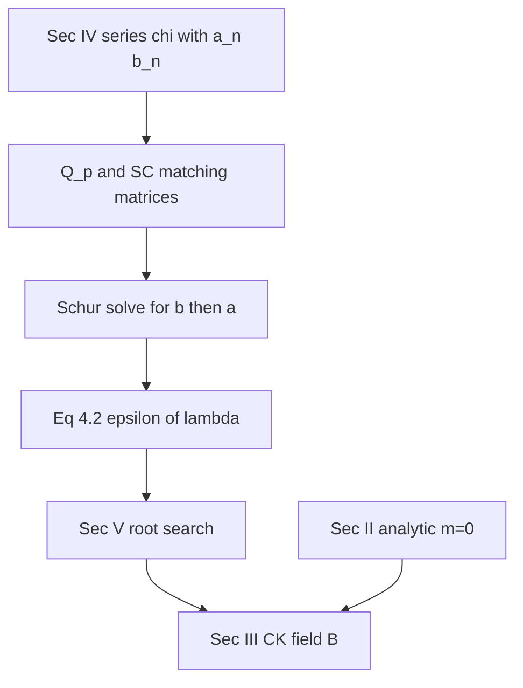

# Beltrami eigenvalue finder

NumPy / SciPy implementation of Morse, *Eigenfunctions of the curl in
cylindrical geometry*, J. Math. Phys. **46**, 113511 (2005),
DOI [10.1063/1.2118447](https://doi.org/10.1063/1.2118447).

Authoritative source in this repo:
[`Morse - 2005 - Eigenfunctions of the curl in cylindrical geometry.pdf`](../Morse%20-%202005%20-%20Eigenfunctions%20of%20the%20curl%20in%20cylindrical%20geometry.pdf).

The public entry points are `find_beltrami_lam`,
`find_beltrami_lam_axisym`, `generate_beltrami_callable`, and
`generate_beltrami_weighted_callable`. The first two return a frozen
`BeltramiSpectrum` (Sec. IV root search for `m ≥ 1`, analytic Sec. II
enumeration for `m = 0`); the third compiles one JAX field callable per
accepted mode; the fourth compiles a single weighted-sum callable that
contracts the mode axis inside the jit (one graph per `m`, not per mode).
`evaluate_kernel` and `extrapolate_lam` are supporting utilities for
kernel inspection and `N → ∞` Richardson fits. `BeltramiBasis`
orchestrates both finders across an `m` list and exposes `eval` /
`visualize` for weighted fields.

## Conventions

Unit-length cylinder, `Z ∈ [-1/2, 1/2]`, radius `a`, azimuthal mode
`m ≥ 0`, truncation `N = max_order`, paper index `n = 1…N` stored at
array index `i = n-1`.

Generating function for `m ≥ 1` (anharmonic coefficient 1; Morse Sec. IV):

```
chi(R, Z) = (R/a)^m exp(i λ Z)
    + Σ_n b_n [J_m(k_o[n] R) / J_m(k_o[n] a)] cos((2n-1) π Z)
    + i Σ_n a_n [J_m(k_e[n] R) / J_m(k_e[n] a)] sin(2 π n Z)
```

with `k_o[n]² = λ² − (2n−1)² π²` and `k_e[n]² = λ² − 4 n² π²`. Negative
`k²` uses the modified-Bessel `I_m` branch (evaluated with scaled `ive`).
Overall field amplitude remains arbitrary. The `BeltramiSpectrum.anharmonic`
field scales the Sec. IV seed term (`1.0` for Sec. IV modes; `0.0` for
Sec. II axisymmetric modes, which have no anharmonic seed).

**Odd / even naming.** Morse labels “odd” / “even” by the *integer* in
the trigonometric factor, not by Z-parity of `χ`: odd-integer cosines
are even in `Z` (`b_n`); even-integer sines are odd in `Z` (`a_n`).
Code identifiers (`*_odd`, `kz_odd`, `bn`, …) follow the same convention.

### Axisymmetric `m = 0` (Sec. II)

`find_beltrami_lam_axisym` enumerates the closed-form Sec. II modes

```
χ = J_0(k_p R) T_q(Z) ,   k_p = j_{1,p}/a ,   λ² = k_p² + q² π²
```

(`p ≥ 1`, `q = 1…2N`; the trivial `k = 0` root of `J_1` is excluded).
Each mode is encoded as a one-hot `BeltramiSpectrum` so
`generate_beltrami_callable` rebuilds the field through the same path:

| `q` | slot | index |
|---|---|---|
| odd (`q = 2n−1`) | `bn` | `(q−1)//2` |
| even (`q = 2n`) | `an` | `q//2 − 1` |

Even-`q` modes ride the `an` slot, which the series multiplies by an
explicit factor of `i`, so those fields emerge as `i × (real field)` —
an arbitrary global eigenmode phase, left as-is.

## Paper-to-implementation walkthrough



1. **Sec. IV series.** `_precompute` builds axial wave numbers
   `kz_even = 2nπ`, `kz_odd = (2n−1)π` and the sine-to-cosine operator
   `SC(n, n′)`. `_forcing` evaluates the anharmonic projections
   `u_odd` / `u_even` (code names `u_cos` / `u_sin`).
2. **`Q_p` and matching matrices.** `_q_and_jm` is Morse’s radial
   log-derivative on the `J` / `I` / power-law branches.
   `_eps_batch` assembles
   `M_even = (a/(mλ)) SC diag(Q_even)` and
   `M_odd = (a/(mλ)) SCᵀ diag(Q_odd)`.
3. **Reduced solve (not Eq. (4.1) as written).** Morse forms inverse
   component matrices `z1`, `z2` and solves `Z_even · a = u1′`,
   `Z_odd · b = u2′`. This code uses the algebraically equivalent Schur
   reduction that never builds those inverses:
   `(I − M_even M_odd) b = u_odd − M_even u_even`,
   then `a = u_even − M_odd b`.
4. **Eq. (4.2).** `ε(λ) = Σ_n b_n (−1)^n/(2n−1) − π sin(λ/2)/λ`. Roots
   are the eigenvalues.
5. **Sec. V root search.** `find_beltrami_lam` grids `ε`, bisects every
   sign-changing bracket in lockstep, optionally polishes with scalar
   `brentq`, and rejects `λ = pπ` trivial zeros and `J_m(ka)` poles.
6. **Sec. II axisymmetric.** `find_beltrami_lam_axisym` enumerates
   closed-form `m = 0` eigenvalues and encodes them as one-hot
   `BeltramiSpectrum` coefficients (`anharmonic = 0`).
7. **Sec. III CK field.** `generate_beltrami_callable` rebuilds
   `B_R, B_φ, B_Z` from `χ` and returns Cartesian `(B_x, B_y, B_z)` for
   both Sec. II and Sec. IV spectra.

### Array-shape guide

| Axis | Meaning |
|---|---|
| `K` | batch of trial λ values |
| `N` | retained Fourier terms (`max_order`) |
| `n_modes` | accepted eigenvalues |
| `n_lam` | search brackets (`status` length) |
| `...` | arbitrary broadcastable field-point batch |

NumPy broadcasting provides the λ-batch map inside `_eps_batch`
(`lam[:, None]`, `sc[None, :, :]`, …). JAX broadcasting provides the
field-point map (`r[..., None]`, `sum(axis=-1)`). There is no
`jax.vmap`, `jax.lax.scan`, or λ-batch chunking.

### Root-search lifecycle

| Stage | What happens |
|---|---|
| Grid | `ε` and `sign(J_m)` on `n_lam+1` endpoints |
| Classify | sign change / non-finite / pole crossing |
| Bisect | compact `live` gather → midpoint batch → scatter |
| Polish | scalar `brentq` per converged bracket |
| Filter | reject `λ≈pπ`, large `|ε|`, near-duplicates |
| Recover | `_eps_batch(..., full=True)` for `a_n`, `b_n`, `k²` |

## Validated reference numbers

| Case | This implementation | Morse (2005) |
|---|---|---|
| `m=1`, `a=1`, lowest root, `N→∞` | `λ/π = 1.7342624` | `1.73426` |
| `m=1`, `a=10` thin disk | `λ = 3.18296` | asymptote `3.18265` |

At an eigenvalue both `a_n` and `b_n` decay like `n⁻⁴`. Off an
eigenvalue, `a_n` decays like `n⁻²` while `b_n` stays at `n⁻⁴`.
Self-convergence of `λ(N)` is `N⁻²`; `extrapolate_lam` Richardson-fits
`1/N²` (and `1/N⁴` when three orders are given). The last ~10 % of
coefficients are truncation-contaminated and are excluded from tail
exponent fits.

## Degenerate and singular cases

- Removable resonances at `λ = pπ` in the forcing vectors are rewritten
  so the resonant entry limits to `−1`.
- Smooth spurious zeros at `λ = pπ` (trivial field; Sec. V) are rejected
  by `pi_guard` and recorded as `IntervalStatus.SPURIOUS_PI`.
- Poles of the `J_m(k a)` normalization (Sec. IV) are flagged as
  `POLE_CROSSING` and dropped when `|ε|` exceeds `tol`.
- True degenerate eigenfields at `λ = pπ` for special `(m, a)`
  (Morse §VI, Sonine polynomials) are not implemented.

## JAX field callables

`generate_beltrami_callable(spectrum)` requires JAX and enables 64-bit
JAX (`jax_enable_x64`) so the Bessel/`I` profiles stay finite. It
returns one `jax.jit` callable per accepted mode, so `len(fns)` equals
`spectrum.n_modes`, not the number of search intervals.

Each callable is `(r, phi, z) -> B_xyz` with broadcastable real inputs
and a `complex128` output of shape `(..., 3)`: the full complex
Chandrasekhar–Kendall field in Cartesian components, not its real part.
Pass `real=True` to return `float64` `Re(B)` instead. Radial Bessel/`I`
profiles are evaluated in JAX (so `jacfwd` curl is smooth). Overall
amplitude is set by `spectrum.anharmonic` on the Sec. IV seed plus the
`an` / `bn` coefficients (paper convention: anharmonic coefficient 1
for `m ≥ 1`).

`generate_beltrami_weighted_callable(spectrum)` returns a single jitted
`(r, phi, z, weights) -> B_xyz` that contracts the mode axis inside the
jit. Spectrum arrays stay batched as `(M,)` / `(M, N)`; this is the
entry point used by `BeltramiBasis.eval` so a large basis compiles one
graph per `m` block rather than inlining one body per mode. Per-mode
callables are thin wrappers around one-mode slices of the same body.

## BeltramiBasis.eval and visualize

`BeltramiBasis.eval(r, phi, z, weights)` returns the weighted sum of
all retained modes. `visualize(weights, name, ...)` writes the same
field to `{name}.vts` (chunked; axis included only when every active
mode has `m = 0`). `visualize_basis(i, name, ...)` is a one-hot
wrapper that preserves the
`{name}_i{i}_m{m}_lam{round(lam, 3)}.vts` filename.

## Stellarator symmetry

`BeltramiBasis(..., stellsym=True)` keeps only the anti-equivariant
real quadrature of each mode. Let `Q` be the 180° rotation about the
horizontal axis at `φ = π/nfp` (`det Q = +1`). Then every retained
field satisfies

```
B(Qx) = −Q B(x)
```

i.e. cylindrical parity `(B_R, B_φ, B_Z) = (−, +, +)`. Because curl and
λ are real, `Re(B)` is itself a Beltrami field. Implementation:

- every callable is compiled with `generate_beltrami_callable(..., real=True)`
  and returns `float64`
- `m > 0` mode counts are unchanged (the discarded imaginary part is
  the opposite parity class)
- `m = 0` even-`q` (`an`) modes are dropped: they are purely imaginary,
  so `Re(B)` vanishes identically

The symmetry holds about `φ = kπ/nfp` for any integer `k`, since every
constructed `m` is a multiple of `nfp`. No extra plane parameter is
needed.

## Why NumPy / SciPy

Per-λ work is one dense `N×N` product and one LAPACK solve. JAX lacks
`I_m` at arbitrary integer order and would force a compiled dynamically
masked bisection; autodiff is not required for the root search. Numba
would not beat BLAS here.
